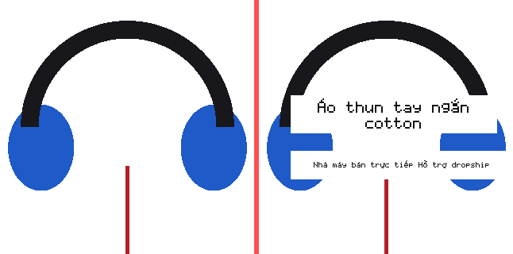

# MVP-02 — HỒ SƠ NGHIỆM THU (dành cho Owner)

> Mục đích: để anh **tự chạy và tự nhìn** trong vài phút, rồi ký nghiệm thu — không phải tin vào
> lời kể của agent. Mọi số liệu dưới đây lấy từ lệnh chạy thật trên máy anh ngày **03/10/2026**.

- Nhánh: `develop` (đã merge PR [#20](https://github.com/thanhbn123/studio/pull/20), merge commit `55aed67`)
- Bộ test: **510 test · 509 pass · 0 fail · 1 skipped** (skip duy nhất: ca PostgreSQL trong `test/store.test.js`, chỉ chạy khi KHÔNG có `DATABASE_URL`)
- CI GitHub: **5/5 job PASS** — Linux · **PostgreSQL 16 thật** · smoke server thật · Docker + chạy luồng MVP-02 trong image · quét secret
- Phản biện độc lập: **4 lượt** — lượt 1 `FAIL` (1 CRITICAL) → các lượt sau `PASS CÓ ĐIỀU KIỆN` → **`PASS`**; 14 phát hiện đã vá và kiểm lại độc lập (nguyên văn: [`MVP-02-REVIEW.md`](MVP-02-REVIEW.md))

---

## 1. Bốn lệnh anh chạy (khoảng 30 giây)

```bash
cd "<thư mục repo>"

npm test                # 510 test · 509 pass · 0 fail · 1 skipped
npm run verify          # kiểm cú pháp toàn bộ src/public/tools/test + chạy test → EXIT 0
npm run demo:imagelab   # chạy trọn luồng dịch ảnh, in bằng chứng đo được
npm start               # mở http://127.0.0.1:3000 → tab "Dịch ảnh Trung → Việt"
```

`npm run demo:imagelab` **tự dựng ảnh mẫu 800×800** (không cần ảnh của anh) và in ra:

```
✓ Ảnh gốc không đổi sau toàn bộ luồng: 81bcdbef…e0681      ← luật #2
   Ảnh kết quả   : data/imagelab-demo/rendered.png (800×800)
   Ảnh TRƯỚC|SAU : data/imagelab-demo/truoc-sau.png   ← mở file này để NHÌN bằng mắt
NHÃN KIỂM CHỨNG: MOCK_VERIFIED — các bước dùng provider giả: OCR_DETECT, TRANSLATION.
```

Muốn dùng ảnh thật của anh: `node tools/imagelab-demo.mjs --image <ảnh.png>` (ảnh PNG).

---

## 2. Điều đáng nhìn nhất: ảnh TRƯỚC | SAU



> **Ảnh này là ẢNH MẪU DO MÁY SINH** (nền xám + 6 ô xám mô phỏng vùng chữ) — **không phải ảnh sản
> phẩm thật**, và ô xám **không phải chữ Trung thật** (bộ render nội bộ không có glyph chữ Hán).
> Nó tồn tại chỉ để anh nhìn được **luồng** đúng hay sai.

Nhìn từ trái sang phải, anh sẽ thấy:

| Vùng | Loại | Trước | Sau |
|---|---|---|---|
| r2, r3 | chữ **mô tả** | ô xám | **đã xoá chữ cũ + vẽ chữ Việt có dấu**: “Áo thun tay ngắn cotton”, “Nhà máy bán trực tiếp hỗ trợ dropship” |
| r1 | **nhãn hiệu** | ô xám | **GIỮ NGUYÊN** — không dịch, không xoá |
| r4 | **chứng nhận** | ô xám | **GIỮ NGUYÊN** |
| r5, r6 | hotline / **giá** | ô xám | **GIỮ NGUYÊN** |

Đúng ba luật bất khả xâm phạm của MVP-02: ảnh gốc bất biến · nhãn hiệu/chứng nhận/giá không bị
dịch hay xoá · không vừa hộp thì bỏ qua chứ không vẽ tràn.

---

## 3. Checklist nghiệm thu (anh tick từng dòng)

| # | Điều cần kiểm | Cách kiểm | Kỳ vọng | ☐ |
|---|---|---|---|---|
| 1 | Toàn bộ test xanh | `npm test` | 509 pass · 0 fail · 1 skip | ☐ |
| 2 | Kiểm cú pháp + test | `npm run verify` | EXIT 0 | ☐ |
| 3 | Luồng dịch ảnh chạy thật | `npm run demo:imagelab` | `Trạng thái job: succeeded`, nhãn `MOCK_VERIFIED` | ☐ |
| 4 | **Ảnh gốc bất biến** | nhìn dòng `✓ Ảnh gốc không đổi…` trong output demo | sha256 trước = sau | ☐ |
| 5 | **Nhãn hiệu/chứng nhận/giá không bị đụng** | mở `data/imagelab-demo/truoc-sau.png` | 4 ô bên phải của các vùng đó giữ nguyên | ☐ |
| 6 | Chữ Việt **có dấu** được vẽ thật | cùng ảnh trên | “Áo thun tay ngắn cotton” đọc được | ☐ |
| 7 | Usage event đủ 3 bước | output demo, mục `USAGE_EVENT` | `OCR_DETECT` · `TRANSLATION` · `IMAGE_RENDER` | ☐ |
| 8 | Nhãn trung thực | output demo + UI | có `MOCK_VERIFIED`, **không** có `LIVE_VERIFIED` | ☐ |
| 9 | Server thật + UI | `npm start` → mở tab “Dịch ảnh Trung → Việt” | kéo-thả ảnh → bảng duyệt từng dòng → Render → ảnh trước/sau | ☐ |
| 10 | Không rò rỉ bí mật | `curl -s localhost:3000/api/config \| grep -i key` | không có khoá nào trong response | ☐ |
| 11 | Tài liệu trung thực | đọc [`VERIFICATION.md`](VERIFICATION.md) §12 | có mục “còn thiếu / chưa đo” nói thẳng | ☐ |
| 12 | **Dùng được trên ẢNH THẬT** (không cần OCR trả tiền) | xem §4 dưới đây | nhập vùng tay → dịch → render ra ảnh có chữ Việt | ☐ |

---

## 4. Dùng trên **ẢNH THẬT** ngay hôm nay (chưa cần dịch vụ OCR)

**Vì sao cần mục này:** `OCR_PROVIDER=mock` (mặc định) trả về vùng chữ của một **fixture cố định** —
không liên quan tới ảnh anh dán vào. Nên muốn thử trên ảnh sản phẩm thật, anh **tự nhập vùng chữ**
(IL-08) — cùng tinh thần với “manual fallback” của MVP-01: OCR không được là điểm chết duy nhất.

**Cách A — trên giao diện:**

1. `npm start` → mở `http://127.0.0.1:3000` → tab **“Dịch ảnh Trung → Việt”** → kéo-thả ảnh PNG của anh.
2. Mở khối **“Nhập vùng chữ bằng tay”** (tự mở khi OCR đang là mock) → nhập từng vùng:
   `x` · `y` · `w` · `h` (pixel trên ảnh gốc, gốc toạ độ ở **góc trên-trái**) · **chữ Trung** · **loại**
   (`descriptive` = chữ mô tả → sẽ được dịch; `brand` / `certification` / `price` → **bị khoá**).
3. Bấm **“LƯU VÙNG & DỊCH”** → bảng duyệt hiện từng dòng → sửa nếu cần → **“RENDER ẢNH”**.
4. Xem ảnh **trước/sau** ngay trong trang.

**Cách B — bằng dòng lệnh** (nhanh, không cần mở trình duyệt):

```bash
cat > /tmp/vung.json <<'JSON'
[
  { "box": { "x": 40,  "y": 40,  "w": 200, "h": 40 }, "text": "品牌旗舰店", "kind": "brand" },
  { "box": { "x": 40,  "y": 120, "w": 360, "h": 60 }, "text": "纯棉短袖T恤 厂家直销", "kind": "descriptive" },
  { "box": { "x": 40,  "y": 700, "w": 180, "h": 44 }, "text": "¥39.9 包邮", "kind": "price" }
]
JSON

node tools/imagelab-demo.mjs --image "/đường/dẫn/ảnh-của-anh.png" --regions /tmp/vung.json
# → in bằng chứng + ghi ảnh TRƯỚC|SAU vào data/imagelab-demo/
```

Điều đúng đắn cần thấy ở đường này:

- Dòng `[2] Vùng chữ → N vùng do người dùng nhập — ĐÃ BỎ QUA OCR` (không có bước OCR nào chạy).
- `USAGE_EVENT` **không** có `OCR_DETECT` — vì không hề OCR, ghi vào là bịa.
- Nhãn kiểm chứng chỉ liệt kê các bước **thật sự** dùng provider giả.
- Vùng nằm ngoài ảnh / chữ rỗng ⇒ bị **từ chối kèm lý do** (`BOX_OUTSIDE_IMAGE`, `TEXT_EMPTY`),
  không im lặng bỏ.
- Vùng `brand` / `certification` / `price` vẫn **bị khoá** đúng như khi OCR đọc ra.

---

## 5. Những gì nghiệm thu này **KHÔNG** bao gồm (nói thẳng)

1. **Chất lượng provider THẬT chưa đo.** OCR mặc định là **mock** (fixture dựng tay, `is_mock = true`);
   dịch và render cũng chạy mock/nội bộ. **Chưa có kết luận nào về model thật.** Muốn đo: cắm
   `OCR_PROVIDER=http` (+ `OCR_BASE_URL`, `OCR_API_KEY`) và/hoặc `TRANSLATE_PROVIDER=ai` với key thật
   — việc này **tốn tiền thật**, cần anh đồng ý.
2. **Chỉ xử lý PNG ở chế độ nội bộ.** `RENDER_PROVIDER=purejs` chỉ giải mã PNG (8-bit, color type
   0/2/4/6, non-interlaced). JPEG/WebP/GIF trả `UNSUPPORTED_IMAGE` — **không giả vờ thành công**;
   muốn nhận các định dạng đó phải cắm `RENDER_PROVIDER=http`.
3. **Trình duyệt thật (DOM) chưa đo.** UI được kiểm bằng cách chạy **hàm thật** của `public/app.js`
   trong Node (15 test: XSS, khoá vùng, nhãn MOCK), chưa mở DOM thật.
4. **Guardrail vẫn là regex.** Đã bắt được cách nói vòng tiếng Việt, ký tự vô hình, số viết bằng
   chữ, full-width, homoglyph Kirin/Greek, biến thể chính tả. **Còn lọt có chủ đích** (vá sẽ tăng
   dương tính giả): `xii`, `3件装 → "3 bộ"`.
5. **`session_id` không phải xác thực.** “404 theo session” là chống truy cập nhầm, không phải hàng
   rào bảo mật — MVP-05 sẽ thay bằng tài khoản thật (đã ghi ở [`VERIFICATION.md`](VERIFICATION.md) §8.2).
6. **Ba chỗ phủ test còn mỏng** (đã đo, không phải đường nghiệp vụ): `render/image.js` 75,4% ·
   `render/png.js` 81,4% · `translate/util.js` 81,6%.

---

## 6. Ký nghiệm thu

| | |
|---|---|
| Người nghiệm thu | Owner (anh) |
| Ngày | .......................... |
| Phán quyết | ☐ ĐẠT — chuyển sang giai đoạn tiếp theo · ☐ CẦN SỬA (ghi rõ bên dưới) |
| Ghi chú | |

**Việc tiếp theo sau khi ĐẠT** (theo [`ROADMAP.md`](ROADMAP.md)): hoặc (a) cắm provider **thật** để
đo chất lượng trên dữ liệu thật, hoặc (b) mở **MVP-03 — Image Generation / Retouching**.
