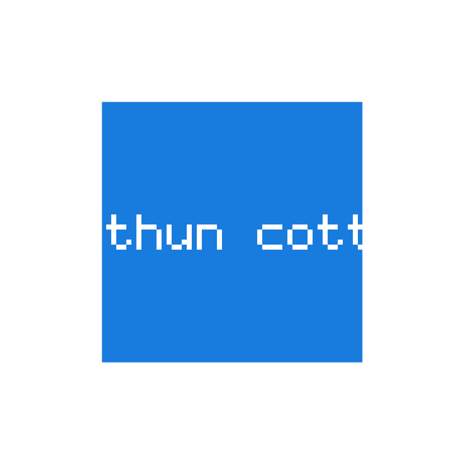

# MVP-04 (phần OFFLINE) — HỒ SƠ NGHIỆM THU (dành cho Owner)

> Để anh **tự chạy và tự nhìn** rồi ký — không phải tin lời kể của agent.
> Số liệu lấy từ lệnh chạy thật trên máy anh ngày **07/10/2026**.

- Nhánh: `feat/mvp04-videostudio` → PR [#23](https://github.com/thanhbn123/studio/pull/23) — **ĐÃ MERGE** vào `develop` (merge commit `af2b2da`)
- Bộ test: **929 test · 928 pass · 0 fail · 1 skipped** · `node tools/verify.mjs` EXIT=0
- CI: **5/5 job PASS** (Linux · PostgreSQL 16 · smoke server thật · Docker · quét secret)
- Phản biện độc lập **5 vòng**: `FAIL` → `FAIL` → `PASS CÓ ĐIỀU KIỆN` → `FAIL` → `PASS CÓ ĐIỀU KIỆN`
  (điều kiện cuối là N3, **đã vá**) — nguyên văn: [`MVP-04-REVIEW.md`](MVP-04-REVIEW.md)

---

## 1. Làm được gì

Từ **ảnh sản phẩm thật** + **chữ Việt** → **video bán hàng ngắn** (GIF động), **không cần dịch vụ
trả tiền**, **không cần `ffmpeg`** (máy anh không có ffmpeg — đã kiểm).

| Việc | Kết quả |
|---|---|
| Ghép ảnh thành video có nhịp | ✅ bộ nén **LZW tự viết trong repo** (không thư viện ngoài) |
| Chữ Việt (tiêu đề, phụ đề, CTA) | ✅ engine font của MVP-02 |
| 3 tỉ lệ **9:16 · 1:1 · 16:9** | ✅ pad/crop — **không bóp méo** (đo lệch ≤ 0,02%) |
| **Nhiều ảnh ⇒ nhiều cảnh** | ✅ thứ tự bám **đúng thứ tự ảnh gửi** |
| Chuyển cảnh + zoom/pan | ✅ |
| Tab **“Video”** trong giao diện | ✅ chọn ảnh → tỉ lệ → chữ từng cảnh → TẠO VIDEO → xem trước + tải về |

---

## 2. Ba lệnh anh chạy

```bash
npm test          # 929 test · 928 pass · 0 fail · 1 skipped
npm run verify    # kiểm cú pháp + test → EXIT 0
npm start         # http://127.0.0.1:3000 → tab thứ tư "Video"
```

Trên giao diện: kéo-thả **một hoặc nhiều ảnh PNG** → chọn **tỉ lệ** → nhập **chữ từng cảnh** + thời
lượng → chọn `pad` (thêm viền) hoặc `crop` (cắt bớt) → **TẠO VIDEO** → xem GIF chạy ngay trong trang.

---

## 3. Video mẫu (mở file này bằng trình xem ảnh)



> GIF do chính repo tạo: **3 cảnh** (3 ảnh khác màu), **25 khung**, tỉ lệ **1:1 (900×900)**, có chữ
> Việt **“Áo thun cotton” / “Chất liệu thoáng mát” / “Giao hàng toàn quốc”**, **KHÔNG có tiếng** (GIF
> không chứa âm thanh — đúng như hệ thống khai báo).

---

## 4. Checklist nghiệm thu

| # | Điều cần kiểm | Cách kiểm | Kỳ vọng | ☐ |
|---|---|---|---|---|
| 1 | Test xanh | `npm test` | 928 pass · 0 fail · 1 skip | ☐ |
| 2 | Verify xanh | `npm run verify` | EXIT 0 | ☐ |
| 3 | Video chạy được | `npm start` → tab “Video” | tạo ra GIF chạy được + tải về | ☐ |
| 4 | **Không bóp méo ảnh** | chọn 9:16 với ảnh vuông | ảnh được **thêm viền** hoặc **cắt bớt**, không kéo giãn | ☐ |
| 5 | **Nhiều ảnh ⇒ nhiều cảnh** | chọn 3 ảnh theo thứ tự A, B, C | video phát đúng thứ tự A → B → C | ☐ |
| 6 | **Không có tiếng thì phải nói rõ** | nhìn kết quả | luôn có câu **“Video KHÔNG có tiếng”** | ☐ |
| 7 | **Chữ bịa bị chặn** | nhập `Bảo hành 12 tháng` khi ảnh/tên chưa có | báo **422**, **không** vẽ chữ nào | ☐ |
| 8 | Chữ lành vẫn vẽ được | nhập `Áo thun cotton` | video **có chữ** đó | ☐ |
| 9 | Ảnh gốc bất biến | tạo video xong, mở lại ảnh gốc | không đổi | ☐ |
| 10 | Nhãn trung thực | `/api/config` + UI | `videostudio.audio = false`; không có nhãn `LIVE_VERIFIED` | ☐ |
| 11 | Tài liệu trung thực | [`VERIFICATION.md`](VERIFICATION.md) §20 | có mục “còn thiếu / chưa đo” nói thẳng | ☐ |

---

## 5. Những gì nghiệm thu này **KHÔNG** bao gồm (nói thẳng)

1. **Video KHÔNG có tiếng.** GIF không chứa âm thanh. Voice-over tiếng Việt và nhạc nền cần **dịch vụ
   TTS trả tiền** — chưa làm.
2. **Chưa có MP4/H.264.** Cần `ffmpeg` (máy anh không có) hoặc dịch vụ ngoài. Provider đã viết nhưng
   **fail-closed** (`FFMPEG_NOT_AVAILABLE`) — **không bịa MP4**.
3. **GIF tối đa 256 màu/khung** (có cảnh báo khi sai số lượng tử hoá vượt ngưỡng).
4. **Nhịp phát thật có thể ngắn hơn khai báo ~4%** (delay GIF làm tròn 10 ms); hệ thống nay ghi cả
   `playback_ms`/`requested_ms` để anh đối chiếu.
5. **Chỉ nhận PNG** cho ảnh đầu vào (JPEG/WebP cần chuyển trước).
6. **Chưa đo**: UI trên trình duyệt thật (đã kiểm bằng hàm thật trong Node), PostgreSQL cho job video,
   nhiều video 30 giây chạy song song, provider thật.
7. **Bằng chứng chống bịa = dữ liệu anh ĐÃ LƯU trong job** (tên sản phẩm, vùng chữ OCR/nhập tay, ghi
   chú). Nghĩa là nếu anh tự lưu câu “bảo hành 12 tháng” vào job thì hệ thống coi đó là bằng chứng —
   đây là lựa chọn có chủ ý và **đã ghi trong hợp đồng**.

---

## 6. Ký nghiệm thu

| | |
|---|---|
| Người nghiệm thu | Owner (anh) |
| Ngày | .......................... |
| Phán quyết | ☐ ĐẠT · ☐ CẦN SỬA (ghi rõ bên dưới) |
| Ghi chú | |

**Sau khi ĐẠT**, phần còn lại của dự án chỉ gồm những việc **cần anh quyết**:
**đo provider thật** (tốn tiền) · **MVP-06 thanh toán** (cần nhà cung cấp + pháp nhân) ·
**MVP-07/08 đăng bài lên Facebook/TikTok/Shopee** (cần tài khoản được duyệt).
